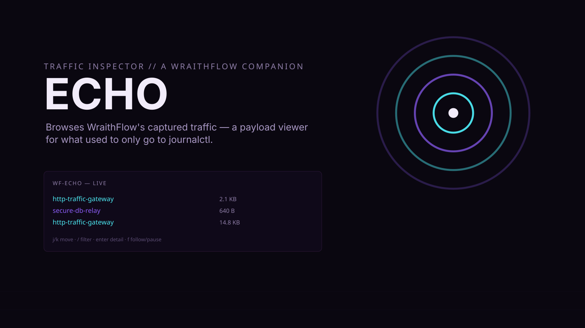

<p align="center">
  
</p>

<p align="center">
  <a href="https://darkstardevx.github.io/echo/">Site →</a>
</p>

[](https://github.com/darkstardevx/echo/actions/workflows/ci.yml)
[](https://github.com/darkstardevx/echo/actions/workflows/release.yml)

> A companion to [WraithFlow](https://github.com/darkstardevx/wraithflow) — not a standalone proxy.

Traffic inspector TUI — browses [WraithFlow](https://github.com/darkstardevx/wraithflow)'s
captured traffic. Installed binary: `wf-echo` (not `echo` — that would shadow
the real shell builtin/coreutil for anything that bypasses bash's own
builtin resolution).

## 📦 Install

```bash
curl -fsSL https://raw.githubusercontent.com/darkstardevx/echo/main/install.sh | sh
```

Downloads the latest release for your platform (Linux or macOS, x86_64
or aarch64), verifies its SHA-256 checksum, and installs `wf-echo` to
`~/.local/bin`. Or build from source with `cargo build --release`.

## Why

WraithFlow already does the proxy/capture engine (hexdump/JSON/raw/base64,
filterable, redactable) and has its own TUI (`wf-tui`) — but that's a live
*stats* dashboard (connection counts, throughput, errors), not a payload
browser. Captured traffic only ever went to stdout, which under systemd
means `journalctl -u wraithflow` and nothing else — unbrowsable,
unsearchable.

WraithFlow gained one small addition: an optional `capture_log` config
field that writes every logged packet to a shared JSONL file alongside the
existing stdout output. Echo tails that file and gives you an actual flow
list: scroll through captured traffic, filter by pipeline or content,
inspect a flow's full rendered content, follow live or pause to browse
history.

## Usage

```
wf-echo            # TUI flow viewer
wf-echo --list     # JSON dump of every captured flow, for scripting
```

Keys: `j/k` move, `/` filter (pipeline name or content substring),
`enter`/`l` flow detail, `f` toggle follow-live/browse-history, `R` reload,
`?` help, `q` quit.

## Setup

Echo reads `capture_log` from WraithFlow's own config
(`~/.config/wraithflow/config.toml`) — nothing to configure in Echo itself.
If WraithFlow doesn't have it set yet:

```toml
capture_log = "~/.local/state/wraithflow/captures.jsonl"
```

then restart wraithflow. Echo will tell you exactly this if the capture
log isn't configured yet, rather than just silently showing nothing.

## Not built

TLS interception/MITM certificate handling, request replay/edit-and-resend
— genuine mitmproxy features, but a much bigger scope than "browse what
WraithFlow already captured." WraithFlow itself is protocol-agnostic (raw
TCP byte forwarding), so HTTP-semantic parsing (headers/bodies as
structured fields, not just rendered text) would also be a real future
extension, not part of this pass.
